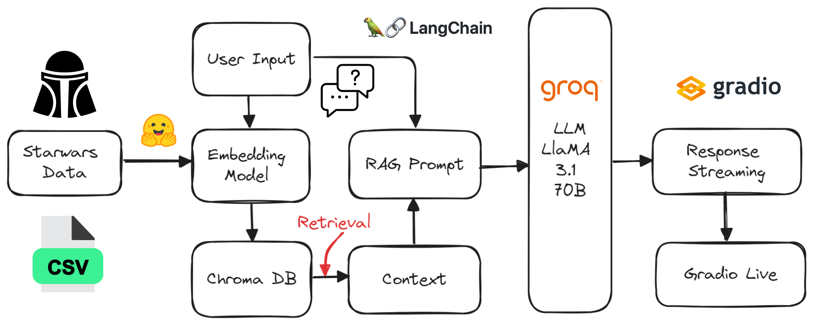
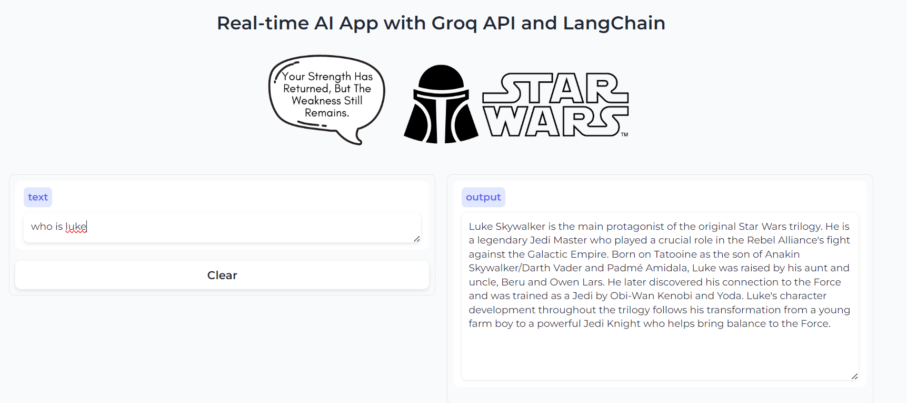

## Project Diagram

## To run the App
1. Generate the Groq API by going to the website: https://console.groq.com/keys.
2. Create the environment variable "Groq_API_Key" using the API.
3. Install all the required Python Packages using `pip install -r requirements.txt`
4. Run the Gradio app file `python app.py`

